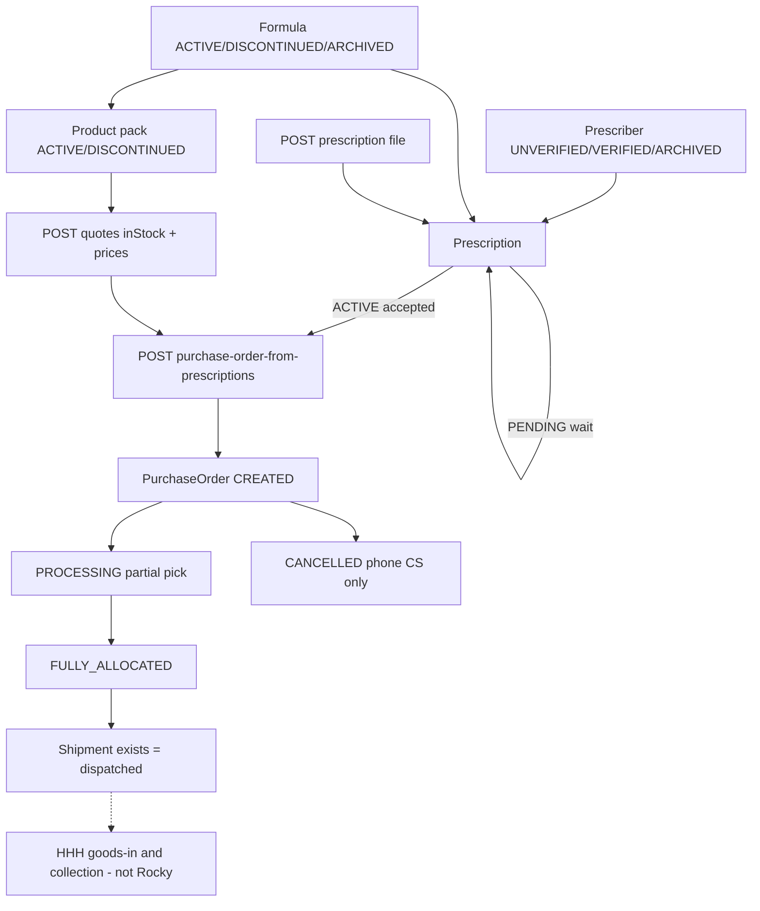

# SQL-first orders: Curaleaf Rocky, Worldpay, and HHH schema use

**Status:** evidence from Primary Pharmacy sandbox, 19 August 2026.
**Audience:** platform, SQL Connect, pharmacy order fulfilment.
**Not in this document:** API keys, Secret Manager payloads, patient names, addresses, emails, or payment-card data.

This note is the operational companion to `dataconnect/schema/schema.gql`. The schema is already a relational design. Live HHH does not use most of it. Pharmacy list/detail, cancel, refund, and Curaleaf progress are derived from `Order.quoteSnapshot` JSON, then patched by live Rocky list calls on every portal request. That is why SQL queries feel slow and why paid-cancel / refund / “Call Curaleaf” states drift.

---

## 1. What was probed

| Source | Environment | Method |
| --- | --- | --- |
| Curaleaf Laboratories Customer API (Rocky) OpenAPI 3.1 spec `1.0` | `https://api.curaleaflaboratories.dev` | Full path inventory from `/openapi.json` |
| Primary Pharmacy write key | Secret `hhh-curaleaf-<org>-europe-west2` | GET every published collection, GET-by-id, `stateFilter`, `purchaseOrderId`, `formulaId`, events **without** `after`, POST `/v1/quotes/` only. No PO/prescription writes. |
| Worldpay Access | Try host `https://try.access.worldpay.com` | Payment Queries first resolves `GET /paymentQueries/payments?transactionReference=`, then retrieves `GET /paymentQueries/payments/{paymentId}` for lifecycle events and refund actions, using the pharmacy Worldpay secret. Refund actions must be verified in Try before live enablement. |
| Firebase SQL Connect | `hhh-platform-service` europe-west2 | Inline GraphQL read of Primary Pharmacy orders, payments, refunds, lines, prescriptions, shipments, receipts, placement events, integration operations. Operational fields only. |

HHH runtime (`services/api-sql`) already defaults Rocky to the **sandbox** host. Production Rocky is `https://api.curaleaflaboratories.co.uk`. Same routes; do not mix keys across hosts.

Primary Pharmacy Curaleaf credential has a **write key only** (no separate read key). Tenant `customerId` on every customer-scoped payload matched this pharmacy. Reject any payload whose `customerId` differs.

Rate limit observed: list/detail GETs returned in 25–150 ms. Honour `429` / `Retry-After`. HHH already spaces calls ≥1.1 s.

---

## 2. Rocky mental model (this is the API, not HHH)

Rocky is a **B2B warehouse API**. It does not know HHH orders, Worldpay, goods-in, collection, or refunds.



Rules Rocky actually enforces (Welcome text + live data):

1. Justify the order with a **prescriber**, then an **accepted prescription**, then a **purchase order**.
2. A formula is what can be prescribed. A product is a pack of that formula. Prescriptions speak `{ formulaId, unitsNeededCount }`. Product POs speak `{ productId, count }`.
3. Paid HHH orders must use `POST /v1/purchase-order-from-prescriptions/` so Rocky ties packs to the script. `POST /v1/purchase-orders/` is valid Rocky and **must not** be used after a prescription id exists.
4. There is **no cancel/delete route**, **no invoice route**, **no courier delivered timestamp**, **no webhooks**. Cancellation is Curaleaf CS. HHH infers `CANCELLED` from GET/events.
5. Events are `{ <entity>Id, customerId?, lastUpdated }` only. Fetch the entity for state.

---

## 3. Every Rocky route, live behaviour, and HHH use

Trailing slashes are required. List query params: `pageNumber`, `pageSize`, `sortColumn`, `sortDirection`, `searchQuery`, `stateFilter` (and extras noted below).

Pagination envelope (lists): `{ <collection>, totalRecordCount, paginationSettings }`.
Error envelope (missing entity): `{ code: "RESOURCE_NOT_FOUND", data: { resourceId, resourceType } }` with HTTP 404.

### 3.1 Catalogue

| Method | Path | Live 19 Aug 2026 | HHH |
| --- | --- | --- | --- |
| GET | `/v1/formulas/` | 430 formulas. Page size honoured (50 returned). Keys: `id, state, formulaForm, unit, printedName`. **No `customerId`.** States in page: `ACTIVE`. Enum also: `DISCONTINUED`, `ARCHIVED`. Forms include `FLOS`, oils, vapes, etc. Units: `g`, `ml`, `mg`, `count`. | Quote bank / formulary. |
| GET | `/v1/formulas/{id}/` | Same object as list row. | Unused; list is enough. |
| GET | `/v1/products/` | **216 products**, `pageSize=50` still returned all 216 (sandbox ignores page size when the set is small). Keys: `id, customerId, state, formulaId, formulaName, formulaUnit, quantity, patientPackPrice`. States: 211 `ACTIVE`, 5 `DISCONTINUED`. Extra filter: `formulaId`. | Quote bank. `quantity` is **not** the placement gate (see quotes). |
| GET | `/v1/products/{id}/` | Same as list row. One ACTIVE oil pack had `quantity: 10`. | Unused. |
| GET | `/v1/products/?formulaId=` | For the first formula in the formulas page, **0 products**. Many formulas have no pack. Do not assume 1:1. | Optional catalogue join. |
| POST | `/v1/quotes/` | Body `{ items: [{ packId, quantity }] }`. 200: `{ shippingPrice, taxRate, items: [{ packId, quantity, inStock, wholesalePackPrice, patientPackPrice }] }`. Prices are **decimal strings**, tax `0.2`. | Create-order quote and pre-placement re-quote. **This is the stock/price authority.** |

**Stock contradiction (live):** the product with `quantity: 10` quoted `inStock: false`. HHH must never place from `Product.quantity`. `CuraleafQuoteBankEntry.inStock` must be filled from quotes (daily refresh + live quote), not from the products list.

`patientPackPrice` on Product is a recommended patient pack price string. Wholesale exists **only** on Quote (and shipment `packPrice`).

### 3.2 Prescribers

| Method | Path | Live | HHH |
| --- | --- | --- | --- |
| GET | `/v1/prescribers/` | 7 rows. Keys: `id, pin, customerId, state, gmcNumber, gphcNumber, name, initials`. States: **6 `UNVERIFIED`, 1 `VERIFIED`**. GMC/GPhC may be null. | Match PIN + GPhC/GMC before create. |
| POST | `/v1/prescribers/` | Body: `name, initials, pin, gmcNumber, gphcNumber`. | Create only when no match. |
| GET | `/v1/prescribers/{id}/` | Same as list row. | Unused. |

`UNVERIFIED` is not a hard stop in sandbox: ACTIVE prescriptions exist. Do not invent a “must be VERIFIED” gate unless Rocky starts returning 4xx on prescription create.

### 3.3 Prescriptions

Enum `PrescriptionState`: `PENDING` | `ACTIVE` | `FULFILLED` | `EXPIRED` | `CANCELLED`.

Live counts (15 total): ACTIVE 9, FULFILLED 3, PENDING 1, EXPIRED 1, CANCELLED 1. **Every official state exists in this pharmacy’s sandbox.**

| Method | Path | Live | HHH |
| --- | --- | --- | --- |
| GET | `/v1/prescriptions/` | Keys: `id, serialNumber, state, prescriberId, prescriberName, customerId, issueDate, expiryDate, items[]`. Item keys: `id, prescriptionId, formulaId, formulaName, unit, unitsNeededCount, unitsAssignedCount`. Extra filters: `stateFilter`, `purchaseOrderId`. | Activity list; poller uses events + GET-by-id. |
| GET | `/v1/prescriptions/?stateFilter=` | Works. `PENDING` → 1, `CANCELLED` → 1, `ACTIVE` → 9. | Useful for operator tools; not required on the hot path if SQL stores `supplierPrescriptionState`. |
| GET | `/v1/prescriptions/?purchaseOrderId=` | For live PO `2bf991a2-…` (CREATED, HHH customerReference present): **0 prescriptions**. Rocky does **not** reliably reverse-join PO → script on this filter. | **Do not use this as the HHH foreign key.** Persist `prescriptionId` at `POST /prescriptions/` time. |
| POST | `/v1/prescriptions/` | Body: `serialNumber, prescriberId, issueDate, items[{ formulaId, unitsNeededCount }]`. Returns prescription id. | Manual scripts after `PAID`. |
| GET | `/v1/prescriptions/{id}/` | Same `PrescriptionWithItems` as list (includes items). | Waiter: `PENDING` = do not create PO; `ACTIVE` = place; `EXPIRED`/`CANCELLED` = stop. |
| GET | `/v1/prescriptions/{serial}/` | **Wrapped:** `{ prescription: Prescription }` and **items are omitted**. | Prefer GET-by-id. |
| POST | `/v1/prescriptions/{id}/file/` | Multipart, 16 MB, PDF/JPEG/PNG. | Required copy. Do not purge GCS until a PO exists. |
| GET | `/v1/prescriptions/{id}/file/` | 200 `application/pdf` (binary, not JSON). | Unused by HHH (we already have the scan). |
| POST | `/v1/prescription-from-image/` | Clinic barcode scripts only. | Portal helper; paid HHH still finishes with PO-from-prescriptions. |

#### How Rocky uses prescription state (observed)

| State | `unitsAssignedCount` vs needed | Meaning for HHH |
| --- | --- | --- |
| `PENDING` | 0 / needed | Script not accepted. **Never** `POST purchase-order-from-prescriptions`. Stamp waiter; fulfilment stays `SUPPLIER_PENDING`. |
| `ACTIVE` | often 0 / needed; one live row 20 / 40 | Accepted. Partial assignment does **not** flip the header to FULFILLED. Safe to create a PO (one HHH order → one PO → one prescription id). |
| `FULFILLED` | assigned == needed (10/10, 20/20) | Rocky has allocated the prescribed units across POs. Further POs against this script will fail or no-op; HHH must not retry placement. |
| `EXPIRED` | 0 / needed | Stop. Recreate script. |
| `CANCELLED` | 0 / needed | Stop. Phone CS if a PO is still live. HHH must not treat “HHH cancelled” as this state. |

Rocky has **no `REJECTED` state**. HHH already maps a rejected request onto `CANCELLED` locally. Do not write `REJECTED` into SQL enums.

Prescription expiry is a **date**, not a timestamp. Issue/expiry are independent of PO `issuedDate`.

### 3.4 Purchase orders

Enum `PurchaseOrderState`: `CREATED` | `PROCESSING` | `FULLY_ALLOCATED` | `CANCELLED`.

Live counts (16 total): CREATED 10, PROCESSING 3, FULLY_ALLOCATED 1, CANCELLED 2.

PO body keys: `id, state, courier, customerReference, customerId, issuedDate, shippingAddress[], createdAt, items[]`.

Item keys: `id, purchaseOrderId, productId, formulaId, packSize, unit, packsOrderedCount, packsAllocatedCount, packsReturnedCount`.

**The PO object has no `prescriptionId`.** That is why snapshot `prescriptionId` is missing on 13/14 HHH orders even when `prescriptionState` is stamped `ACTIVE` after a PO exists.

| Method | Path | Live | HHH |
| --- | --- | --- | --- |
| GET | `/v1/purchase-orders/` | `stateFilter` works (`CANCELLED` → 2, `CREATED` → 10). `customerReference` is the join key HHH already sends (`HHH-<orderId>-…` or `ORD-…`). | Poller / list attach. Replace list-on-portal with SQL. |
| GET | `/v1/purchase-orders/{id}/` | Same as list row. Missing UUID → `RESOURCE_NOT_FOUND` / `PurchaseOrder`. | Event poller GET-after-event. Prefer this over listing 200 POs on every Orders page load. |
| POST | `/v1/purchase-order-from-prescriptions/` | Body `{ customerReference, prescriptionIds[] }`. **The only paid-HHH create.** | After `PAID` + `ACTIVE` prescription. One PO per prescription. |
| POST | `/v1/purchase-orders/` | Body `{ customerReference, items[{ productId, count }] }`. | **Do not use** for paid pharmacy orders. |

Couriers live: `POLAR_SPEED` on every Primary Pharmacy PO. Enum also: `DX`, `CURALEAF`, `TRANSFER`, `OTHER`.

#### How Rocky uses PO state (observed)

| State | Allocation pattern | HHH fulfilment mapping (supplier side only) |
| --- | --- | --- |
| `CREATED` | `packsAllocatedCount = 0`, ordered > 0 | `SUPPLIER_PROCESSING`. Hide goods-in. **Still a live PO** — cancel requires Curaleaf CS even if HHH already marked refunded. Avery T PO `2bf991a2-…` is this state. |
| `PROCESSING` | `0 < allocated < ordered` (or allocated moving) | `SUPPLIER_PROCESSING` until shipments exist. Split ships are normal. |
| `FULLY_ALLOCATED` | allocated == ordered | `SUPPLIER_ALLOCATED`. Goods-in still pharmacy-side. |
| `CANCELLED` | allocated typically 0 | `EXCEPTION`. HHH then: replace **or** prepare refund. Never invent a Rocky delete. |

Shipments are **not** a PO state. A PROCESSING PO can already have a shipment. HHH `DISPATCHED_TO_PHARMACY` is “shipment exists”, not `FULLY_ALLOCATED`.

`packsReturnedCount` is Rocky returns, not HHH goods-in shorts. Do not overload `ReceiptIssue`.

### 3.5 Shipments

There is **no `ShipmentState` enum**. The resource existing **is** “dispatched”.

Live: 3 shipments. Keys: `id, customerId, shipmentCharge, taxRate, shippingAddress[], createdAt, purchaseOrderId, purchaseOrderCustomerReference, purchaseOrderIssuedDate, items[]`.

Item keys: `id, shipmentId, purchaseOrderItemId, productId, formulaId, sku, unit, productPackSize, packCount, packsReturnedCount, packPrice, batchNumber, batchExpiryDate`.

`shipmentCharge` was `"0"`; `taxRate` `"0.2"`; `packPrice` wholesale string (e.g. `"68"`). Batch numbers present. Filter `?purchaseOrderId=` works: CREATED Avery PO → 0 shipments.

| Method | Path | HHH |
| --- | --- | --- |
| GET `/v1/shipments/` | List all. | Poller + (today) portal list. |
| GET `/v1/shipments/{id}/` | Detail. | Event poller. |
| GET `/v1/shipments/?purchaseOrderId=` | Empty until dispatch. | Prefer SQL `Shipment.supplierPurchaseOrderId` after poll. |

Arrival, check-in, ready-for-collection, collected are **HHH only**.

### 3.6 Events (no webhooks)

Without `after`, Rocky dumps history:

| Route | Live count without `after` | Payload |
| --- | --- | --- |
| `/v1/formula-events/` | 430 | `{ formulaId, lastUpdated }` — **no customerId** |
| `/v1/product-events/` | 499 | `{ productId, customerId, lastUpdated }` |
| `/v1/prescriber-events/` | 7 | `{ prescriberId, customerId, lastUpdated }` |
| `/v1/prescription-events/` | 15 | `{ prescriptionId, customerId, lastUpdated }` |
| `/v1/purchase-order-events/` | 16 | `{ purchaseOrderId, customerId, lastUpdated }` |
| `/v1/shipment-events/` | 3 | `{ shipmentId, customerId, lastUpdated }` |
| `/v1/clinical-need-events/` | 0 | same shape |

HHH poller already uses `after=` + 2 s overlap. Keep that. **Never** GET events with no cursor on a cron — 499 product events is a rate-limit own goal.

After an event: GET `/v1/{entity}/{id}/`. Deduplicate with `IntegrationWebhookEvent.eventKey` (already the worker event store).

### 3.7 Clinical needs (do not implement)

`GET/POST /v1/clinical-needs/`, GET/PUT by id, file, signed, events. Live list: 0 rows. Specials workflow. HHH pharmacy orders stay formula prescription + PO-from-prescriptions.

### 3.8 Routes that do not exist

No `DELETE /v1/purchase-orders/{id}`. Any leftover cancel-and-archive client is not Rocky. Detect `CANCELLED`.

---

## 4. Worldpay: routes, states, and the SQL hole

Worldpay is **payment only**. It never talks to Rocky. HHH never initiates money movement from a webhook or cancellation event. An authenticated pharmacy staff refund action may submit a refund through the provider API; completion still requires provider evidence.

Each pharmacy asks its Worldpay Implementation Manager to register `https://europe-west2-hhh26-4ebd2.cloudfunctions.net/apiLondon/v1/public/payments/worldpay/webhook` for payment lifecycle events. The webhook payload is only a reconciliation signal; HHH authenticates with that pharmacy's stored API username/password and independently verifies the transaction reference, amount, currency, entity and refund evidence through Payment Queries.

### 4.1 Calls HHH already makes

| Call | Host | Media type | Purpose |
| --- | --- | --- | --- |
| `POST /payment_pages` | `try.access.worldpay.com` (live: `access.worldpay.com`) | `application/vnd.worldpay.payment_pages-v1.hal+json` | Create HPP / PayByLink. Body: `transactionReference`, `merchant.entity`, `narrative.line1` (24 chars), `value.{currency,amount pence}`, `expiry` seconds, `resultURLs`, optional `customisation_id`. Success: `url` or `_links.redirect.href`. |
| `GET /paymentQueries/payments?transactionReference=` then `GET /paymentQueries/payments/{paymentId}` | same host | `application/vnd.worldpay.payment-queries-v1.hal+json` | Resolve the payment summary, then retrieve settlement truth, event history and current action links. Match `paymentId`, `transactionReference`, amount, currency and merchant entity. |
| Provider refund action returned by the payment resource | same host only | Link-specific Card Payments media type, or `application/json` + `WP-Api-Version` for `_actions` | Staff-initiated full/partial refund. Follow only an HTTPS action on the configured Worldpay host. `202` means accepted, not completed. |

Credential check with a random reference returned **200** and `_embedded.payments: []` — not found is a valid 200.

### 4.2 Provider `lastEvent` → HHH `PaymentStatus`

From `worldpay-query.ts` (do not invent extra events):

| Worldpay lastEvent (normalised) | HHH |
| --- | --- |
| `sentForSettlement`, `settlementRequestSubmitted`, `saleSucceeded`, `settled`, `settlementSucceeded` | `PAID` |
| `refused`, `authorizationRefused`, `saleRefused`, `error`, `authorizationFailed`, `saleFailed`, `settlement*Failed` | `FAILED` |
| `cancelled` / `canceled`, `cancellationRequestSubmitted` | `CANCELLED` |
| `expired` | `EXPIRED` |
| `sentForRefund`, `refundRequested`, `refundRequestSubmitted`, `refundFailed`, `refundRequestSubmissionFailed` | `REFUND_REQUIRED` (HHH still records a **manual** refund task; this only means the provider thinks a refund is in flight or failed) |
| `refunded`, `refundSucceeded` | `REFUNDED` |
| authorisation / unknown | `PENDING` — **authorised is not paid** |

`settlePaidWorldpayPayment` currently sets SQL `Payment.status = PAID` then places Curaleaf. It does not always stamp `Order.paidAt`. Live: **5 of 11 `PAID` orders have `paidAt` null.** Portal gates that use `paidAt` then skip “Call Curaleaf”.

### 4.3 Live Payment table vs Order table (Primary Pharmacy)

| Fact | Count |
| --- | --- |
| Orders | 14 |
| Order `paymentStatus` PAID / REFUNDED / PENDING | 11 / 2 / 1 |
| Order `paymentRoute` MANUAL / WORLDPAY | 11 / 3 |
| `Payment` rows | 18 |
| Payment PENDING / PAID | 8 / 10 |
| `Refund` rows | **0** |
| Worldpay Payment Queries for three stored `WP-…` refs | 200, **not found** |

Problems:

1. **One order, many PENDING Worldpay rows** (order `117e0a8f-…` has at least seven `WP-MSWK…` links). `Payment.transactionReference` is globally unique, but nothing supersedes the previous PENDING row. Reconciliation walks orphans. Queries return not found (Try lag, expiry, or links never opened).
2. **Avery T Worldpay order** (`e7e91a37-…`): Order `CANCELLED` + `REFUNDED`, `paidAt` null, **no Payment row**, Rocky PO still `CREATED`. Snapshot `refund.status = completed` with a staff reference. HHH closed money in JSON while Worldpay and Rocky did not.
3. Manual `Payment` rows can be `PAID` with `paidAt` null and `transactionReference` null — the Order flags are the only signal, and they disagree.
4. Refund confirmation writes snapshot JSON, not `Refund`. Confirming a refund cannot be queried with `WHERE payment_status = REFUND_REQUIRED`.

Worldpay is efficient **if and only if** there is exactly one live `Payment` per order (`PENDING` or terminal), `Order.paidAt` is set in the same transaction as `Payment.status = PAID`, and refunds live in `Refund`.

---

## 5. How HHH SQL is used today (the efficiency problem)

The 1000-line schema already has `OrderLine`, `OrderPrescription`, `Payment`, `Refund`, `Shipment`, `ShipmentLine`, `GoodsReceipt`, `PlacementEvent`, `IntegrationOperation`, `CuraleafQuoteBankEntry`. Live Primary Pharmacy:

| Table | Rows | Used as source of truth? |
| --- | --- | --- |
| `Order` + `quoteSnapshot` JSON | 14 | **Yes.** Portal `toPortalOrder` reads snapshot.curaleaf, refund, cancellation, prescriptions, lineItems, pricingQuote. |
| `Payment` | 18 | Partial. Missing for some paid Worldpay orders; extras for abandoned links. |
| `Refund` | 0 | No. Refunds are `quoteSnapshot.refund`. |
| `OrderLine` | 0 | No. Lines are snapshot `items` / `lineItems`. |
| `OrderPrescription` | 1 | Almost no. Placement identity is snapshot. |
| `Prescription` | 1 | Almost no. `supplierPrescriptionId` not filled for 13 orders. |
| `Shipment` | 3 | **Yes** (poll/list attach writes these). Matches Rocky’s 3. |
| `GoodsReceipt` | 2 | **Yes** (pharmacy goods-in). |
| `PlacementEvent` | 14 | Noise. Many `PENDING_PLACEMENT → PENDING_PLACEMENT` on link regeneration. |
| `IntegrationOperation` | 0 | No idempotent Rocky/Worldpay log. |
| `CuraleafQuoteBankEntry` | (implemented) | Catalogue path exists; still re-quote live at placement. Correct. |

Snapshot key union on live orders: `curaleaf`, `items`/`lineItems`, `pricingQuote`, `prescriptions`, `quoteReview`, `refund`, `cancellation`, `curaleafCancellation`, money fields, `environment`. Nested `curaleaf` holds a **copy of the Rocky PO plus shipments, lines, shippingAddress**. Max snapshot ~2.9 KB; total ~30 KB for 14 orders. Size is not the problem. **Unqueryable JSON + re-fetching Rocky on every list** is the problem.

### 5.1 The hot path that must die

`GET /v1/portal/orders` today:

1. `ListTenantOrders` in `order.sql.ts` selects **every column including `quoteSnapshot`** (the checked-in connector query does not; the API bypasses it with inline GraphQL).
2. If Curaleaf is linked, **list all Rocky POs and all shipments** (`pageSize=200`).
3. For **each** HHH order, `attachCuraleafToOrder` matches by `customerReference` / stored id, rebuilds fulfilment lines, and **writes `quoteSnapshot` when the JSON key changes**.

That is O(orders) JSON parse + O(Rocky catalogue of POs) on a staff page refresh, plus write amplification. SQL is reduced to a document store.

The 60 s event poller is the right shape (cursor → GET by id → persist). Portal GET should read SQL only.

### 5.2 State machines HHH invented on top of Rocky/Worldpay

Keep these — they are product, not duplicates of Rocky — but store them as columns.

| Concern | Today | Should be |
| --- | --- | --- |
| HHH order lifecycle | `OrderStatus` | Keep. |
| Money taken | `paymentStatus` + `paidAt` + snapshot refund | `Payment` row + `Order.paidAt` always together. |
| Manual refund task | snapshot `refund` | `Refund` (`PENDING_CONFIRMATION` / `COMPLETED` / `FAILED`). |
| Supplier cancel needed | snapshot `curaleafCancellation` + live PO state | `OrderPrescription.placementState` + `supplier_po_state`. Live `CREATED`/`PROCESSING`/`FULLY_ALLOCATED` ⇒ Call Curaleaf first. |
| Quote review hold | snapshot `quoteReview` | Column `quote_review_status` + optional top-up `Payment`. |
| Pharmacy goods-in / collection | `FulfilmentStatus` + snapshot lines | `Shipment` + `GoodsReceipt` + `Order.collectedAt` (already in schema). |

HHH never auto-refunds Worldpay from provider events. `PaymentStatus.REFUND_REQUIRED` means a staff-prepared refund remains open; the staff action may submit it to Worldpay, while webhook/reconciliation can only verify and complete that existing record.

---

## 6. Do we need a schema redesign?

**Not a rewrite.** The schema you pasted is the right shape. What is needed is:

1. **Use the tables that already exist** as the write path (placement, poll, payment, refund, goods-in).
2. **Promote a few hot fields onto `Order` / `Payment`** so list/filter queries do not touch JSON.
3. **Tighten uniqueness and indexes** so Worldpay links and supplier ids are queryable.
4. Keep `quoteSnapshot` as an **immutable audit blob** (paid quote + last raw Rocky/Worldpay payload), not the operational model.

`COMPATIBLE` Data Connect mode still applies: additive columns and tables only.

### 6.1 Additive columns (recommended)

On `Order` (denormalised for list/filter; always written in the same mutation as the child row):

```text
supplierPrescriptionId          String   @index   # Rocky prescription UUID
supplierPrescriberId            String
supplierPurchaseOrderId         String   @index   # Rocky PO UUID
supplierCustomerReference       String   @index   # what we sent as customerReference
supplierPrescriptionState       String            # PENDING|ACTIVE|FULFILLED|EXPIRED|CANCELLED
supplierPurchaseOrderState      String            # CREATED|PROCESSING|FULLY_ALLOCATED|CANCELLED
supplierLastSyncedAt            Timestamp
quoteReviewStatus               String            # null | required | awaiting_top_up | awaiting_refund | approved
supplierCancelRequired          Boolean  @default(false)
```

Alternatively put supplier ids **only** on `OrderPrescription` (already has `supplierPurchaseOrderId`, `placementState`) and join. That is cleaner. Then `ListTenantOrders` must `orderPrescriptions_on_order { … }` in one GraphQL query. Either way, **stop duplicating the PO inside JSON**.

On `Payment`:

```text
providerLastEvent     String
providerQueriedAt     Timestamp
supersededAt          Timestamp   # previous HPP link retired
```

On `Refund`: already enough. Start inserting it.

Optional enum (only if you want type-safety instead of String):

```text
enum SupplierPurchaseOrderState { CREATED PROCESSING FULLY_ALLOCATED CANCELLED }
enum SupplierPrescriptionState { PENDING ACTIVE FULFILLED EXPIRED CANCELLED }
```

Do **not** merge Rocky enums into `OrderStatus` / `FulfilmentStatus`. They are different actors.

### 6.2 Constraints to add (behaviour, then schema)

| Rule | Why |
| --- | --- |
| At most one **live** `Payment` per order (`PENDING` or `AWAITING_MANUAL_PAYMENT`). Creating a new Worldpay link sets `supersededAt` on the previous PENDING row. | Stops 7 orphan `WP-` rows. |
| `Order.paidAt` NOT NULL when `paymentStatus = PAID` or `REFUNDED` (application invariant; check in settle + manual mark-paid). | Fixes Avery-class bugs. |
| `Refund` required before `paymentStatus` can become `REFUND_REQUIRED` / `REFUNDED`. | Portal choice buttons query SQL. |
| Unique `(organisationId, supplierPurchaseOrderId)` where PO id not null. | Poller lookup without scanning snapshots. |
| Unique `(organisationId, supplierPrescriptionId)` where set. | Waiter / FULFILLED guard. |
| `IntegrationOperation.idempotencyKey` already unique — **write a row per Rocky/Worldpay call**. | Retry without double PO. |

`Payment.transactionReference @unique` is already global. Keep it. Retired links stay unique rows with `supersededAt`.

### 6.3 Indexes that make the portal cheap

Data Connect already indexes `organisationId` on tenant tables. Add compound filters the UI actually uses:

- `Order (organisationId, status)`
- `Order (organisationId, paymentStatus)`
- `Order (organisationId, fulfilmentStatus)`
- `Order (organisationId, updatedAt DESC)` — list default
- `Order (organisationId, supplierPurchaseOrderId)`
- `Payment (organisationId, status)`
- `Payment (orderId, status)`
- `Refund (organisationId, status)`
- `Shipment (organisationId, status)`
- `IntegrationOperation (organisationId, status, nextAttemptAt)` — worker claim
- `IntegrationWebhookEvent (organisationId, receivedAt)` if you start listing them

Quote bank already keyed by `(environment, packId)`. Daily refresh should upsert; portal formulary reads this table, not `GET /v1/products/` on click.

### 6.4 Tables you can leave alone

Company, intake, patients, staff, notifications, fees, directory, clinical-need (none). `OrderDraft.payload` JSON is correct — drafts are mutable until promote.

`quoteSnapshot` / `providerPayload` / `requestPayload` stay `Any` for audit and replay. Strip `shippingAddress` from what we persist if it is the pharmacy’s own address (PII-adjacent, unused in UI).

---

## 7. Target write path (SQL + APIs, no snapshot authority)

### 7.1 Create order

1. Staff builds draft (`OrderDraft.payload`).
2. `POST /v1/quotes/` for selected packs. Persist quote into **`OrderLine`** (packId, qty, patient pence, wholesale pence, inStock) and money columns on `Order`. Copy the raw quote into `quoteSnapshot.pricingQuote` once as the paid snapshot.
3. Insert **one** `Payment` (`PENDING` Worldpay or `AWAITING_MANUAL_PAYMENT`).
4. Do not call Rocky.

### 7.2 Pay

**Worldpay:** poll Payment Queries by `transactionReference` until `PAID` (or fail/expire). Same transaction: `Payment.status`, `Payment.paidAt`, `Order.paidAt`, `Order.paymentStatus`. Then enqueue placement (`IntegrationOperation` `curaleaf.place`, `PENDING`).

**Manual:** staff confirms tender. Same stamps. Same enqueue.

Never place Curaleaf without `Order.paidAt`.

### 7.3 Place (Rocky writes)

Idempotent operation, one attempt recorded:

1. Match/create prescriber → store `supplierPrescriberId`.
2. `POST /v1/prescriptions/` → `Prescription.supplierPrescriptionId`, `OrderPrescription`, `supplierPrescriptionState = PENDING|ACTIVE`.
3. `POST …/file/` if needed.
4. GET prescription until `ACTIVE` (or leave waiter).
5. `POST /v1/quotes/` again. If `inStock=false` or patient price moved → `quoteReviewStatus`, **no PO**.
6. `POST /v1/purchase-order-from-prescriptions/` with `customerReference = orderNumber`. Store `supplierPurchaseOrderId`, `supplierPurchaseOrderState = CREATED`, `placementState = PLACED`.
7. Raw PO JSON may be stored on `IntegrationOperation.responsePayload`.

### 7.4 Poll (Rocky reads)

Every 60 s per pharmacy, events with `after=`:

| Event | GET | SQL write |
| --- | --- | --- |
| prescription | GET prescription | `supplierPrescriptionState`; if `ACTIVE` and no PO, retry place; if `CANCELLED`/`EXPIRED`, `supplierCancelRequired` / EXCEPTION |
| purchaseOrder | GET PO | `supplierPurchaseOrderState`, `OrderLine` allocated counts, `FulfilmentStatus` |
| shipment | GET shipment | `Shipment` + `ShipmentLine` (batch, expiry, packCount). Status `DISPATCHED`. |
| product | optional GET or quote-bank refresh | `CuraleafQuoteBankEntry` |

Match order by **`supplierPurchaseOrderId` first**, then `supplierCustomerReference`, never by scanning JSON.

Portal list **does not call Rocky**.

### 7.5 Cancel / refund (product rules, SQL-backed)

```text
if unpaid:
  Order.status = CANCELLED
  Payment = CANCELLED / EXPIRED
  no Refund row
  if supplier PO live: still Call Curaleaf (should be rare; we do not place unpaid)

if paid:
  if supplierPurchaseOrderState in (CREATED, PROCESSING, FULLY_ALLOCATED)
     and not CANCELLED:
       supplierCancelRequired = true
       lock Replace and Prepare-refund
       staff: Call Curaleaf CS → poll until PO CANCELLED (or prescription CANCELLED and no live PO)
  else:
       choice: Create replacement | Cancel & prepare full refund
  Prepare-refund:
       insert Refund PENDING_CONFIRMATION
       Order.paymentStatus = REFUND_REQUIRED
       if Payment.route = WORLDPAY:
         follow the provider refund/partial-refund action
         202 -> Refund VERIFICATION_PENDING
         timeout/5xx -> outcome unknown; do not retry or offer manual fallback
         definitive missing/rejected action -> retain portal confirmation recovery
       if Payment.route = MANUAL:
         retain ePOS reference confirmation
  Complete:
       only provider proof or the manual confirmation path may set Refund COMPLETED
       full -> Payment/Order REFUNDED; partial -> Payment/Order PAID
       webhook never creates or submits a refund
```

Query for the Orders “Refund due” filter:

```graphql
orders(
  where: {
    organisationId: { eq: $organisationId }
    paymentStatus: { eq: REFUND_REQUIRED }
  }
) { id orderNumber totalPence updatedAt }
```

Query for “Call Curaleaf”:

```graphql
orders(
  where: {
    organisationId: { eq: $organisationId }
    supplierCancelRequired: { eq: true }
  }
) { id orderNumber supplierPurchaseOrderId supplierPurchaseOrderState }
```

No `quoteSnapshot` in either query.

### 7.6 List orders (efficient SQL)

Replace `ListTenantOrders` in `order.sql.ts` with the connector-style projection **plus the promoted supplier columns and money**, still **without** `quoteSnapshot`:

```graphql
orders(
  where: { organisationId: { eq: $organisationId } }
  orderBy: { updatedAt: DESC }
  limit: $limit
) {
  id orderNumber status paymentStatus fulfilmentStatus paymentRoute
  totalPence paidAt cancelledAt collectedAt updatedAt
  supplierPurchaseOrderId supplierPurchaseOrderState
  supplierPrescriptionId supplierPrescriptionState
  supplierCancelRequired quoteReviewStatus
  orderLines_on_order { packId formulaName quantity fixedPatientPricePence wholesalePackPricePence placementState }
  orderPrescriptions_on_order { placementState supplierPurchaseOrderId }
  payments_on_order(where: { supersededAt: { isNull: true } }, limit: 1) { id status route transactionReference }
  refunds_on_order(orderBy: { createdAt: DESC }, limit: 1) { id status amountPence }
}
```

Detail endpoint may add `quoteSnapshot` and `IntegrationOperation` history.

Goods-in and collection already have `Shipment` / `GoodsReceipt` — keep writing them; list can expose `fulfilmentStatus` only.

---

## 8. Mapping cheat sheet (Rocky / Worldpay / SQL)

| Actor | State | SQL |
| --- | --- | --- |
| Rocky prescription PENDING | Wait | `PrescriptionStatus.PENDING_PLACEMENT`, `supplierPrescriptionState=PENDING`, no PO |
| Rocky prescription ACTIVE | Place allowed | `PENDING_PLACEMENT` until PO, then `PLACED` |
| Rocky prescription FULFILLED | Do not place again | keep PO; no new from-prescriptions |
| Rocky prescription EXPIRED/CANCELLED | Stop | `PrescriptionStatus.CANCELLED` or `EXPIRED`; `EXCEPTION` if paid |
| Rocky PO CREATED | Live, 0 allocated | `FulfilmentStatus.SUPPLIER_PROCESSING`, `PlacementState.PLACED` |
| Rocky PO PROCESSING | Live, partial pick | `SUPPLIER_PROCESSING` |
| Rocky PO FULLY_ALLOCATED | Picked | `SUPPLIER_ALLOCATED` |
| Rocky shipment exists | In transit | `DISPATCHED_TO_PHARMACY` / `PARTIALLY_*` from line math |
| Rocky PO CANCELLED | Supplier dead | `EXCEPTION`, `PlacementState.CANCELLED_REFUNDED` or hold until refund/replace |
| Pharmacy goods-in | HHH | `PARTIALLY_RECEIVED` / `RECEIVED` |
| Ready / collected | HHH | `READY_FOR_COLLECTION` / `COLLECTED`, `Order.collectedAt` |
| Worldpay not found, link unexpired | | `Payment.PENDING` |
| Worldpay not found, link expired + grace | | `EXPIRED` |
| Worldpay settled | | `PAID` + `Order.paidAt` + enqueue place |
| Staff prepare refund | | `Refund.PENDING_CONFIRMATION`, `Order.REFUND_REQUIRED` |
| Staff confirm reference | | `Refund.COMPLETED`, `Order.REFUNDED` |

Line-level remaining = ordered − allocated − shipped, with pharmacy `received`/`collected` on `FulfilmentLine` **computed from SQL**, not stored only in snapshot `lines`.

---

## 9. Streamlining the platform (priority)

1. **Stop calling Rocky from `GET /portal/orders`.** Poller is the only reader. This is the largest latency and rate-limit win.
2. **Stop selecting `quoteSnapshot` on list.** Mapper reads columns + child tables.
3. **Write `OrderLine` + `OrderPrescription` + `Prescription.supplierPrescriptionId` at placement**, not “when we remember”.
4. **Write `Refund` rows**; delete the synthetic snapshot refund as authority (keep a copy in audit JSON).
5. **One live Payment per order**; stamp `paidAt` with PAID.
6. **Promote supplier ids/states onto Order or always join `OrderPrescription`.** Then cancel/refund UI is `WHERE` clauses, not JSON archaeology.
7. **Use quote bank for browsing; `POST /quotes/` only at price lock and pre-place.** `Product.quantity` is advisory.
8. **Log every Rocky/Worldpay HTTP call in `IntegrationOperation`.** Retries use the idempotency key; double PO becomes detectable.
9. **PlacementEvent only on real transitions** (`PENDING_PLACEMENT → PLACED`, `PLACED → CANCELLATION_PENDING_REFUND`, …). Stop recording no-ops when regenerating payment links.
10. **Indexes + list GraphQL above.** After that, schema redesign is additive columns, not a new ERD.

---

## 10. Suggested implementation slices

Keep `COMPATIBLE`. Do not require a Data Connect schema push until slice 3.

1. **Code only:** portal list uses SQL fulfilment columns already on `Order`; remove Rocky fetch from GET list; keep GET-by-id live attach as a temporary fallback.
2. **Code only:** persist `Refund` and `Order.paidAt` on the existing payment/refund routers; stop treating snapshot refund as the only record.
3. **Schema additive:** supplier* columns + `Payment.supersededAt` / `providerLastEvent`. Backfill from snapshot + Rocky GET-by-id (one-off worker, not the portal).
4. **Code:** placement writes `OrderLine` / `OrderPrescription` / `IntegrationOperation`; poller updates those rows instead of merging JSON.
5. **Code:** `toPortalOrder` reads SQL; snapshot is fallback for historical orders until backfill completes.

---

## 11. Probe appendix (Primary Pharmacy, 19 Aug 2026)

Operational only.

Rocky lists: 430 formulas, 216 products (211 ACTIVE), 7 prescribers (6 UNVERIFIED), 15 prescriptions (all five states), 16 POs (all four states), 3 shipments, 0 clinical needs.

Quote: `inStock: false` for a product with `quantity: 10`. `taxRate: "0.2"`.

HHH SQL: 14 orders (9 PROCESSING, 2 CANCELLED, 2 SUBMITTED, 1 COMPLETED). Snapshot has a PO id on all 14; a stored `prescriptionId` on **1**. Shipments table matches Rocky. Refund table empty while two orders are `REFUNDED`.

Avery T customerReference `HHH-e7e91a37-…-2ed86c9782` → Rocky PO `2bf991a2-3bbf-43ea-ae5b-45654ae5bc4b` still `CREATED`, 2 ordered, 0 allocated, 0 shipments. That is why Call Curaleaf is still the correct first action regardless of HHH `REFUNDED`.

---

## 12. Related docs

- `.agents/rules/curaleaf-rocky.md` — HHH placement rules
- `Rocky-API-Reference.md` / `specs/Rocky-API-Reference.md` — route cheat sheet
- `specs/sql-connect-backend-rewrite.md` — original relational decision
- `.agents/rules/worldpay-paybylink.md` — HPP shape
- `dataconnect/schema/schema.gql` — storage contract
